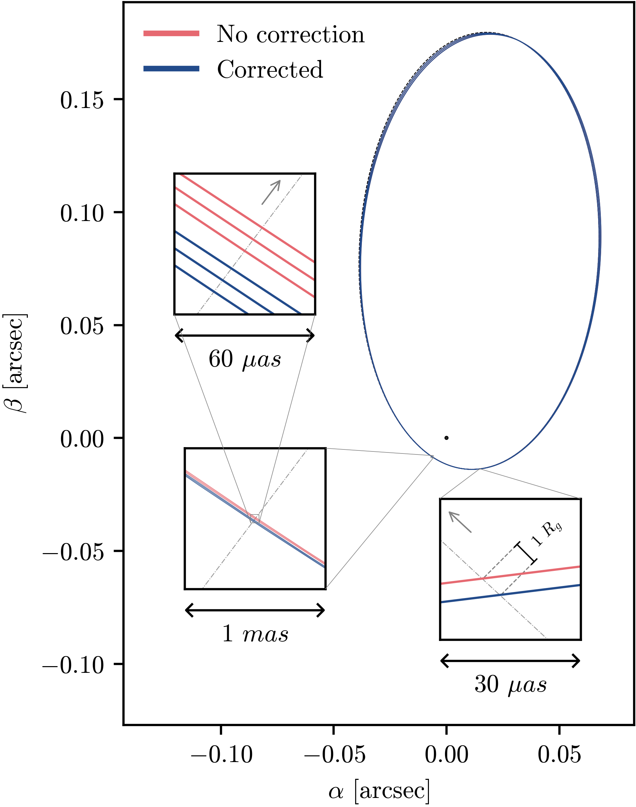
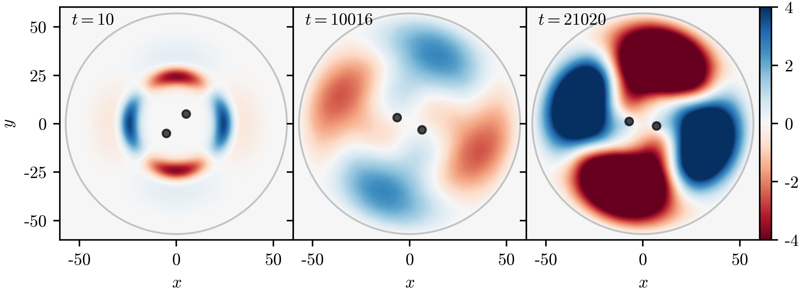

# Polarimetry of Sgr A* flares

Sagittarius A\* (Sgr A\*), the supermassive black hole at the center of our galaxy, provides a unique environment to study extreme gravitational and magnetic fields. Flares from hot spots of plasma orbiting near the black hole’s event horizon emit near-infrared (NIR) light, offering valuable insight into the dynamics of this region. In our study, "Polarimetry and astrometry of NIR flares as event horizon scale, dynamical probes for the mass of Sgr A\*", we used the GRAVITY instrument to observe these flares and probe the inner regions of Sgr A\*.

We found that the flares exhibit a consistent clockwise orbital motion with a period of about 60 minutes, corresponding to a distance of nine gravitational radii from the black hole, near the innermost stable circular orbit. By analyzing both the astrometry and polarization of these flares, we confirmed a predominantly poloidal magnetic field, suggesting that the flares are influenced by accretion flows driven by nearby stellar winds. Our measurements allowed us to confirm the mass of Sgr A\* at approximately 4.3 million solar masses and demonstrated the stability of the magnetic field structure, reinforcing the single black hole model for Sgr A\*.

# Relativistic Astrometry

In our paper "Post-Newtonian theory for precise relativistic astrometry," we revisit the traditional post-Newtonian (PN) expansion formalism to provide accessible formulas for describing the motion of massive and massless particles in generic spherically symmetric spacetimes. The PN expansion is crucial for understanding gravitational phenomena in weak-field regimes and has applications ranging from solar system tests of General Relativity (GR) to the study of gravitational waves. Our goal is to offer ready-to-use equations for observers that account for relativistic effects, particularly in the Galactic Center, where stars orbiting the supermassive black hole Sgr A* provide an excellent laboratory for testing gravity.

We present a self-consistent framework that allows for precise calculations of stellar motions and light deflection with microarcsecond accuracy. This is particularly relevant for observations made with the GRAVITY instrument at the Very Large Telescope Interferometer, which can probe the strong gravitational regime near Sgr A*. By applying our formalism, we demonstrate how different metric theories of gravity, such as the Reissner-Nordström solution, can be tested through precise astrometric measurements. Our work highlights the importance of considering light-bending effects and coordinate system transformations when modeling such observations.

<figure style="display: flex; flex-direction: column; align-items: center; width: 100%; margin: auto;">
  
  <figcaption style="text-align: center; width: 90%;">
    Fig.1 Visual appearance of the S2 orbit in the galactic center. 
  </figcaption>
</figure>

# Binary Superradiance

Superradiance, a process where waves scatter off a rotating object and gain energy, has been extensively studied in axisymmetric systems like black holes. However, it was unclear whether this phenomenon could occur in more complex, non-axisymmetric setups like binary systems. In our paper "Binary superradiance: a numerical study," we explored how rotating binaries can also trigger superradiant instabilities. By modeling a binary system of two absorbing objects revolving around a common center, we demonstrated that superradiant amplification does indeed occur, confirming that such systems can amplify waves and transfer energy, even in highly asymmetric configurations.

Our results suggest that compact binaries, such as black hole pairs, could serve as detectors for new, fundamental ultralight fields, potentially linked to dark matter. These binaries may deposit a fraction of their energy into these fields on specific timescales, offering a new method to probe fundamental physics. This study opens up broader applications, not just in astrophysics but also in fluid dynamics and other areas involving non-axisymmetric rotating systems.

